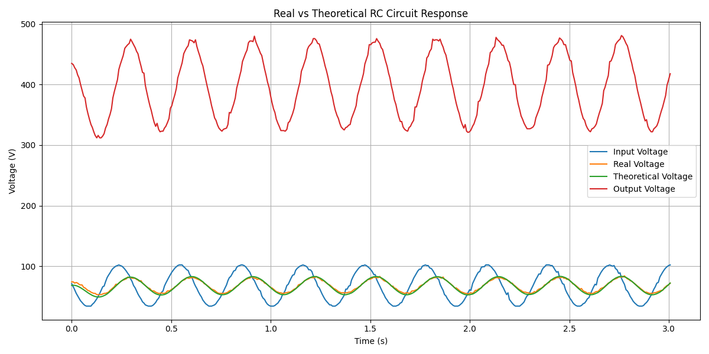
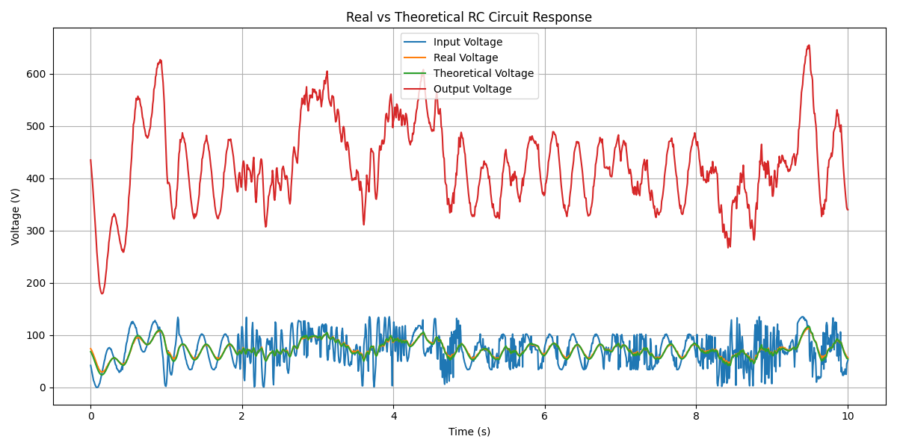

# Analog Signal Filtering and Amplification

This project investigates the behavior of an **RC low-pass filter combined with an operational amplifier stage**.

The input signal is generated with **Arduino** and consists of one or two sine components whose frequencies are controlled by **potentiometers**.  
The signal is filtered by an **RC circuit**, amplified with an **LM358 op-amp**, measured by the **Arduino ADC**, and analyzed using **Python**.

The measured capacitor voltage is compared with the **theoretical RC response**.

---

# System Pipeline

Arduino signal generation → RC low-pass filter → Op-amp amplification → Arduino ADC measurement → Python analysis

---

# Circuit Parameters

## RC Filter

R = 1 kΩ  
C = 100 µF  

Time constant:

τ = RC = 0.1 s

The capacitor voltage follows the differential equation:

dVc/dt = (Vin − Vc) / (RC)

This circuit behaves as a **low-pass filter**, meaning higher frequency components are attenuated while lower frequencies pass through.

---

## Amplifier Stage

Operational amplifier: **LM358**

Ri = 1 kΩ  
Rf = 4.7 kΩ  

Non-inverting amplifier gain:

G = 1 + (Rf / Ri) ≈ 5.7

The filtered signal is amplified before being read by the Arduino ADC.

---

# Experiments

Three experimental configurations were tested.

---

## 1. Single sine input

Only one potentiometer controls the signal frequency.

---

## 2. Two sine components (fixed frequencies)

Both potentiometers generate two sine components with fixed frequencies.

---

## 3. Dynamic frequency variation

Both potentiometers are varied during acquisition, producing a time-varying multi-frequency input signal.

---

# Data Processing

Arduino measurements are exported as **CSV files** and processed using Python.

The analysis script:

analysis/plot_results.py

generates plots comparing:

- input signal
- measured capacitor voltage
- theoretical RC response
- amplified output signal

Python libraries used:

- pandas
- matplotlib

---

# Repository Structure

Analog-Signal-Filtering-and-Amplification

data/
    single_sine.csv
    two_sines_fixed.csv
    two_sines_dynamic.csv

result_images/
    One_potentiometer_max.png
    Both_potentiometers_fixed_frequencies.png
    moving_potentiometers.png

active_rc_filter.ino
analysis/plot_results.py
README.md

---

# Tools Used

- Arduino
- LM358 Operational Amplifier
- Analog RC Circuit
- Python (pandas, matplotlib)

---

# Purpose of the Project

The goal of this experiment is to demonstrate how:

- an **RC circuit acts as a low-pass filter**
- multiple sine components interact in a signal
- an **op-amp amplifier scales the filtered signal**
- theoretical models compare with real hardware measurements

The project combines **analog electronics, signal generation, measurement, and data analysis** in a small experimental pipeline.
